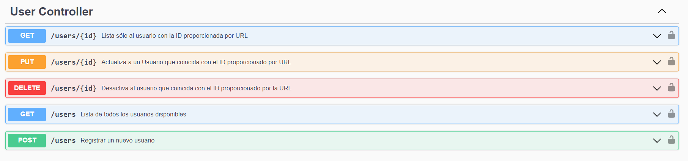
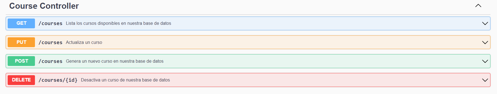
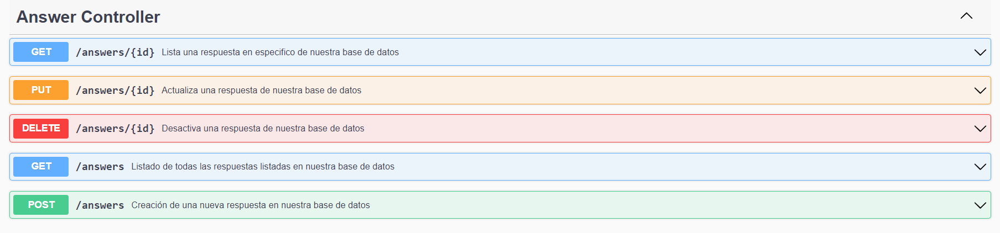

<h1 align="center"> Foro Alura </h1>
<h2 align="center"> Registro y Consulta: Usuarios, Tópicos y Respuestas</h2>

## Tecnologias utilizadas
* Java
* [Maven](https://maven.apache.org) - Manejador de dependencias
* [Spring Initializer](https://start.spring.io)
* [Lombok](https://projectlombok.org) - Code automator
* [FlyWay](https://flywaydb.org) - Database versioning
* [MySQL](https://mysql.com) - Database
* [JWT Token](https://jwt.io) - Login authentication
* [OpenAPI](https://springdoc.org) - Spring documentation

## Introducción

Este proyecto forma parte de un curso ofrecido por Alura y Oracle Next Education.

La función de esta API es facilitar la comunicación entre el front-end y la base de datos. A través de diversos métodos, se pueden crear, obtener, editar y eliminar usuarios, temas, categorías y respuestas.

Cada usuario debe acceder utilizando su nombre de usuario y contraseña, y luego utilizar el token obtenido para realizar las diferentes solicitudes.

## APi methods

* Usuarios
  * username y email únicos
  * roles: ADMIN, USER, VIEWER

* Tópicos
  * vinculada al usuario que la crea y a la categoría que pertenece
  * registro de fecha de creación y de última actualización
  * status: OPEN, CLOSED, DELETED
  * al ser una de sus respuestas marcadas como solución, su status pasa a ser CLOSED

* Respuestas
  * vinculada al usuario que la crea y el tópico al que responde
  * registro de fecha de creación y de última actualización
  * solo una respuesta por tópico puede ser marcada como solución

